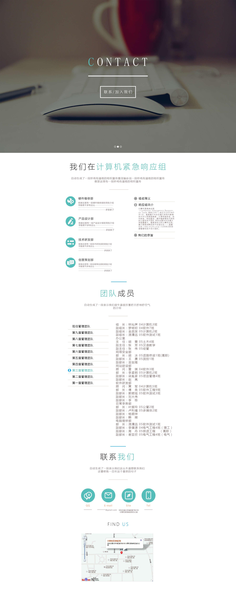

#计算机紧急响应组官网重建需求整理

##菜单结构
```
├─首页
├─部门介绍  
│  ├─创意策划部
│  ├─产品运营部
│  ├─技术研发部
│  ├─硬件维修部
│  ├─……
├─名人堂
│─社团博客
│─团队作品
│  ├─花椒校园通
│  ├─……
│─关于我们
│  ├─社团简介
│  ├─管理团队
│  ├─加入我们
│  └─联系方式
```
##菜单说明
###首页
采用纵向长滚动设计布局  
当进入页面，先使用fakeloader.js模拟预加载效果，优化用户体验
随后，标题从浏览器顶部淡入  
底部的前两个箭头上下浮动，光芒轻轻闪烁  
使用大图作为背景，几句简单有力的介绍，一个“加入我们”的按钮  
菜单的焦点右边光标闪烁  

####耶稣君设计的部分页面
前台页面以金浩设计为准


####Gorgiax设计的首页页面
部分元素参考耶稣君的设计(背景请无视，暂时没有社团照片，等我找时间去拿)


###部门介绍
####Gorgiax设计的部门页面
部分元素参考耶稣君的设计(背景请无视，暂时没有社团照片，等我找时间去拿)

不排除以后部门会有变动，所以不要固定数量，横向平均分成n个部分。  
每个部分都有一个背景图和部门名称。  
饱和度和亮度默认降低，获得鼠标焦点恢复亮度和饱和度，出现简短有力的文字介绍  
点击任意部门后，出现涟漪效果展开，其余的部门分别迅速向两边移动，使用3D动画。

###部门详情
背景图完全展示，显示部门名称和详细介绍。  
向下滚动，展示部门成员，每个成员显示自定义头像，名称，他人介绍(一定要他人介绍)，联系方式。

###名人堂
像部门详情的第二页一样，照片也可以为头像，介绍就由自己写了。

###社团博客
社团运营的博客，由每个写博客的成员投稿。

###团队作品
列出所有作品中等大小的图片，点击进入相应详情页。

###关于我们
先是简介，向下滚动出现管理团队，管理团队由左边的标签来分页，内容由后台生成。  
再向下滚动出现加入我们的页面，几句要求，一个按钮，一幅背景图。s+

最后是联系我们的页面，负责人E-Mail，地址，电话，负责老师，地图。


##后台
采用ThinkCMF内容管理框架。
###成员表结构
```SQL
CREATE TABLE `cmf_members` (
  `id` int(4) unsigned NOT NULL AUTO_INCREMENT,
  `student_id` varchar(16) NOT NULL DEFAULT '' COMMENT '学号',
  `username` varchar(10) NOT NULL DEFAULT '' COMMENT '姓名',
  `classname` varchar(16) NOT NULL DEFAULT '' COMMENT '班级',
  `department_id` tinyint(2) NOT NULL COMMENT '部门id',
  `position_id` tinyint(2) NOT NULL COMMENT '职位id',
  `join_time` date NOT NULL COMMENT '加入时间',
  `face_url`varchar(160) NOT NULL COMMENT '头像链接',
  `introduction` varchar(255) NOT NULL DEFAULT '' COMMENT '个人介绍',
  `link` varchar(160) NOT NULL DEFAULT '' COMMENT '链接',
  `show_depart` bit(1) NOT NULL DEFAULT 0 COMMENT '在部门里展示 0:不显示;1:显示',
  `show_famehall` bit(1) NOT NULL DEFAULT 0 COMMENT '在名人堂里展示 0:不显示;1:显示',
  `create_time` datetime NOT NULL COMMENT '创建时间',
  `update_time` timestamp NOT NULL DEFAULT CURRENT_TIMESTAMP ON UPDATE CURRENT_TIMESTAMP COMMENT '更新时间',
  PRIMARY KEY (`id`),
  UNIQUE KEY (`student_id`)
) ENGINE=MyISAM AUTO_INCREMENT=1 DEFAULT CHARSET=utf8 COMMENT='成员表';
```
###部门表结构
```SQL
CREATE TABLE `cmf_department` (
  `id` tinyint(2) unsigned NOT NULL AUTO_INCREMENT,
  `department_name` varchar(16) NOT NULL DEFAULT '' COMMENT '部门名',
  `department_name_en` varchar(24) NOT NULL DEFAULT '' COMMENT '部门英文标识',
  `brief` varchar(120) NOT NULL DEFAULT '' COMMENT '部门简介',
  `introduction` varchar(400) NOT NULL DEFAULT '' COMMENT '部门介绍',
  `background` varchar(160) NOT NULL DEFAULT '' COMMENT '部门主题背景',
  `orders` tinyint(2) NOT NULL DEFAULT 1 COMMENT '部门显示顺序',
  `flag` bit(1) NOT NULL DEFAULT 1 COMMENT '部门是否运作 0:已关闭;1:运作中',
  `create_time` datetime NOT NULL COMMENT '创建时间',
  `update_time` timestamp NOT NULL DEFAULT CURRENT_TIMESTAMP ON UPDATE CURRENT_TIMESTAMP COMMENT '更新时间',
  PRIMARY KEY (`id`)
) ENGINE=MyISAM AUTO_INCREMENT=1 DEFAULT CHARSET=utf8 COMMENT='部门表';
```

###职位表结构
```SQL
CREATE TABLE `cmf_position` (
  `id` tinyint(2) unsigned NOT NULL AUTO_INCREMENT,
  `position_name` varchar(16) NOT NULL DEFAULT '' COMMENT '职位名',
  `position_name_en` varchar(24) NOT NULL DEFAULT '' COMMENT '职位英文标识',
  `weight` tinyint(2) NOT NULL COMMENT '权重',
  `department_id` tinyint(2) NOT NULL COMMENT '部门id',
  `create_time` datetime NOT NULL COMMENT '创建时间',
  `update_time` timestamp NOT NULL DEFAULT CURRENT_TIMESTAMP ON UPDATE CURRENT_TIMESTAMP COMMENT '更新时间',
  PRIMARY KEY (`id`)
) ENGINE=MyISAM AUTO_INCREMENT=1 DEFAULT CHARSET=utf8 COMMENT='职位表';
```

###团队作品表结构
```SQL
CREATE TABLE `cmf_product` (
  `id` tinyint(2) unsigned NOT NULL AUTO_INCREMENT,
  `product_name` varchar(16) NOT NULL DEFAULT '' COMMENT '作品名',
  `product_name_en` varchar(24) NOT NULL DEFAULT '' COMMENT '作品英文标识',
  `thumb_img` varchar(16) NOT NULL DEFAULT '' COMMENT '预览图',
  `weight` tinyint(2) NOT NULL COMMENT '权重',
  `orders` tinyint(2) NOT NULL DEFAULT 1 COMMENT '显示顺序',
  `create_time` datetime NOT NULL COMMENT '创建时间',
  `update_time` timestamp NOT NULL DEFAULT CURRENT_TIMESTAMP ON UPDATE CURRENT_TIMESTAMP COMMENT '更新时间',
  PRIMARY KEY (`id`)
) ENGINE=MyISAM AUTO_INCREMENT=1 DEFAULT CHARSET=utf8 COMMENT='团队作品';
```

###管理团队表结构
```SQL
CREATE TABLE `cmf_leadership` (
  `id` tinyint(2) unsigned NOT NULL AUTO_INCREMENT,
  `username` varchar(10) NOT NULL DEFAULT '' COMMENT '姓名',
  `department_name` varchar(16) NOT NULL DEFAULT '' COMMENT '部门名',
  `position_name` varchar(16) NOT NULL DEFAULT '' COMMENT '职位名',
  `generation`  tinyint(2) NOT NULL COMMENT '届数',
  `create_time` datetime NOT NULL COMMENT '创建时间',
  `update_time` timestamp NOT NULL DEFAULT CURRENT_TIMESTAMP ON UPDATE CURRENT_TIMESTAMP COMMENT '更新时间',
  PRIMARY KEY (`id`)
) ENGINE=MyISAM AUTO_INCREMENT=1 DEFAULT CHARSET=utf8 COMMENT='管理团队表';
```

###新人报名表结构
```SQL
CREATE TABLE `cmf_application` (
  `id` tinyint(2) unsigned NOT NULL AUTO_INCREMENT,
  `student_id` varchar(16) NOT NULL DEFAULT '' COMMENT '学号',
  `username` varchar(10) NOT NULL DEFAULT '' COMMENT '姓名',
  `classname` varchar(16) NOT NULL DEFAULT '' COMMENT '班级',
  `introduction` varchar(255) NOT NULL DEFAULT '' COMMENT '自我介绍',
  `department_id` tinyint(2) NOT NULL COMMENT '意向部门id',
  `pass` bit(1) NOT NULL DEFAULT 0 COMMENT '是否通过 0:未通过;1:已通过',
  `create_time` datetime NOT NULL COMMENT '创建时间',
  `update_time` timestamp NOT NULL DEFAULT CURRENT_TIMESTAMP ON UPDATE CURRENT_TIMESTAMP COMMENT '更新时间',
  PRIMARY KEY (`id`)
) ENGINE=MyISAM AUTO_INCREMENT=1 DEFAULT CHARSET=utf8 COMMENT='新人报名表';
```

##接口说明
###获取部门列表
####GET
```
index.php?g=club&m=application&a=getDepartList
```
####返回结果示例
```json
{"0":{"id":"15","department_name":"\u6280\u672f\u7814\u53d1\u90e8"},"1":{"id":"16","department_name":"\u786c\u4ef6\u7ef4\u4fee\u90e8"},"2":{"id":"17","department_name":"\u4ea7\u54c1\u8bbe\u8ba1\u90e8"},"3":{"id":"18","department_name":"\u521b\u610f\u7b56\u5212\u90e8"},"referer":"","state":"fail"}
```
###提交社团申请
####POST
```
index.php?g=club&m=application&a=sendApplication
```

####参数说明
Param | Optional | Type | Description
----------|-----|---------|--------------------
**student_id** | False | String | 学号
**username** | False | HTML Encode String | 姓名
**classname** | False | HTML Encode String | 班级名
**department_id** | False | String | 意向部门id
**introduction** | False | HTML Encode String | 自我介绍
成功:1
失败:0